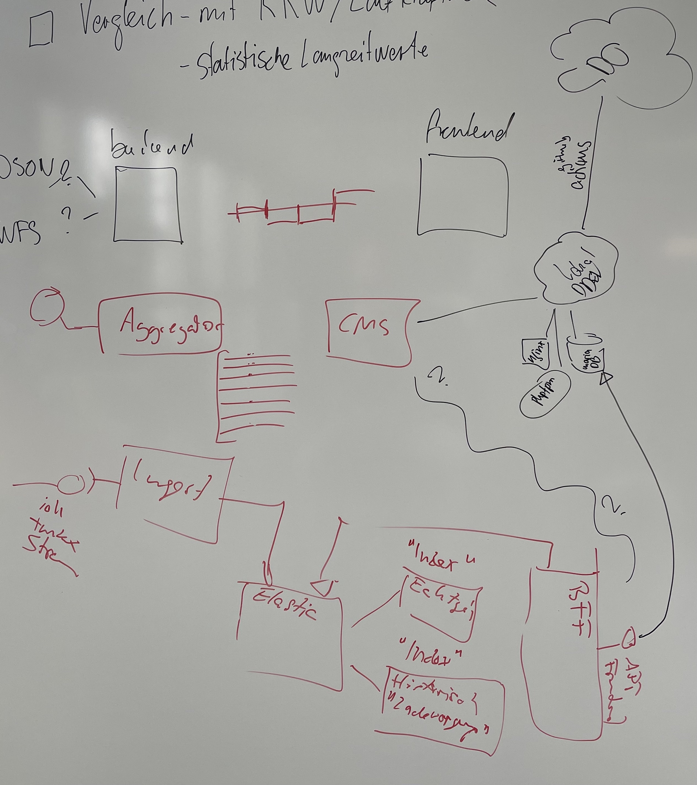

# GovTech Hackathon 2023 - Dashboard Ladestationen Elektroautos
## Einleitung
Die Elektromobilität gewinnt immer mehr an Bedeutung und Elektrofahrzeuge werden zunehmend auf unseren Strassen zu sehen sein. Um den steigenden Bedarf an Ladestationen für Elektrofahrzeuge zu decken und eine effiziente Nutzung dieser Ladestationen zu gewährleisten, ist es wichtig, den Stromverbrauch und Konsum in Echtzeit zu überwachen. Aus diesem Grund wurde im Rahmen einer [Challenge](https://hack.opendata.ch/project/944) das Projekt "Dashboard Ladestationen Elektroautos" ins Leben gerufen, bei dem ein benutzerfreundliches und intuitives Dashboard entwickelt wurde, das die Überwachung des Stromverbrauchs und Konsums bei Ladestationen für Elektroautos ermöglicht. In diesem Projekt wurde die bereits vorhandene Datenquelle [www.ich-tanke-strom.ch](https://www.ich-tanke-strom.ch) genutzt, um den aktuellen Status und die Verfügbarkeit der Ladestationen in Echtzeit zu verfolgen. Dieses Projekt bietet eine Möglichkeit für Netzbetreiber, Behörden und Stromanbieter, den Stromverbrauch und Konsum von Elektroautos bei Ladestationen in Echtzeit zu überwachen und somit eine effektive Planung der Netzauslastung zu gewährleisten.

## Architektur
Dashboard Ladestationen Elektroautos ist eine Online-Plattform, die eine umfassende Datenbank von öffentlichen Ladestationen für Elektrofahrzeuge in der Schweiz bereitstellt. Die Architektur der Plattform umfasst mehrere Komponenten und Technologien.

Die Plattform basiert auf einem Server-Client-Modell, bei dem die Serverseite die Datenbank von Ladestationen verwaltet und die Clientseite die Benutzeroberfläche für  das dashboard  bereitstellt. Die Serverseite wird durch eine API-Schnittstelle bereitgestellt, die von der Clientseite aufgerufen wird.

Die Datenbank der Ladestationen wird von ELASTIC bereitgestellt und durchsucht, um relevante Ergebnisse für die Benutzer zu liefern. Die Plattform nutzt auch DDEV, ein Tool zur Entwicklungsumgebung, um die Entwicklungsumgebung schnell und einfach einzurichten.

Die Benutzeroberfläche der Plattform wurde mithilfe von ReactJS und Openlayers entwickelt, um interaktive Karten und Benutzeroberflächen zu erstellen. Die Plattform ist auch in Craft CMS eingebettet, einem Content-Management-System, das es ermöglicht, Inhalte auf der Plattform einfach zu verwalten.

Insgesamt ist die Architektur von Dashboard Ladestationen Elektroauto darauf ausgelegt, eine einfache, benutzerfreundliche Plattform bereitzustellen, die es Benutzern ermöglicht, schnell und einfach Ladelast öffentliche Ladestationen für Elektrofahrzeuge in der Schweiz darzustellen.

## API/Schnittstelle

Das Backend stellt folgende Endpunkte zur Verfügung:

    /api/charging-points: gibt eine Liste aller verfügbaren Ladestationen zurück
    /api/charging-points/:id/status: gibt den Status (verfügbar, besetzt, defekt) einer bestimmten Ladestation zurück
    /api/charging-points/:id/history: gibt den historischen Stromverbrauch einer bestimmten Ladestation zurück
    
    
## Datenquellen 

[Ladestationen für Elektroautos](https://opendata.swiss/de/dataset/ladestationen-fuer-elektroautos)

[Ausführliche Dokumentation](https://github.com/SFOE/ichtankestrom_Documentation/blob/main/Access%20Download%20the%20data.md)
    

## Datenverarbeitung

Die Daten werden von Python-Skripten verarbeitet, um sie aus den APIs zu sammeln, bereinigen, aggregieren und in eine ELSATIC zu speichern.

## Benutzeroberfläche
Bezogene Energiemenge des Vortages (MWh)
Aktuelle bezogene Ladeleistung (MW)
Aktuelle öffentliche genutzte Ladestandorte (%)
Das Dashboard zeigt des weiteren eine Ladeintensitätskarte: Sie zeigt die aktuell bezogene Ladeleistung. Je intensiver der Gelbton, desto grösser die bezogene Ladeleistung. Das Balkendiagramm zeigt die bezogene Energiemenge pro Tag und Monat

## Anwendungsbeispiele
Die Anwendungsfälle sind breit gefächert von reiner Informationsgewinnung durch den interessierten Bürger, über politische Regulatorien wie die «Nationale Strommangellage» bis hin zur kommerziellen Nutzung der Anbieter von Öffentliche Ladestation. 

* Mit dem benutzerfreundlichen und intuitiven Dashboard kann der Interessierte Bürger jederzeit schweizweit oder lokal (Kanton, Gemeinde) eine minutenaktuelle Übersicht erlangen wo wieviel Strom «getankt» wird. Dazu wird dem weniger technisch bewandertem Bürger ein Referenzvergleich (Stromverbrauch pro vierköpfiges Einfamilienhaues, oder Anzahl Windturbinen zur Erzeugung des aktuellen Strombedarfs)
* Politische Organe bekommen mit dem Dashboard schnell die aktuelle Lage der Stromkonsumation (realtime) der öffentlichen Ladestationen schweizweit oder wenn gewünscht auch lokal (Kanton, Gemeinde). So erhalten sie zusätzliche Entscheid-Grundlagen um z.B. lokal Strom zu begrenzen. 
Diese Informationen können auch via API automatisiert in weitere Systeme übernommen werden
* Kommerzielle Anbieter von öffentlichen Ladestationen bietet die Lösung Informationen, damit der Ausbau von Ladestationen an den «richtigen» Standorten erfolgt (wo wird wann wie viel geladen) und die Möglichkeit «Smart-Charger» bereitzustellen. Dazu dienen hiostroisierte Übersichten über den Tag, die Woche und die Monate. 
Der «SmartCharger» kann einerseits dynamisch den Ladestrom regulieren andererseits auch ein zeitbasiertes Priceing anbieten. Samtliche Daten sind via API verfügbar. 

## Limitationen
Eine Diskussion über die Grenzen des Systems, einschließlich möglicher Einschränkungen bei der Verwendung der verfügbaren Daten und der Genauigkeit der Ergebnisse.

## Zukünftige Entwicklungen
Eine Beschreibung möglicher zukünftiger Entwicklungen des Systems, einschließlich der Integration neuer Datenquellen und der Verbesserung der Benutzererfahrung.

## Links

https://hack.opendata.ch/project/944

## Front-End Repository

https://github.com/jarheadcore/govtech-poc

## Team

https://github.com/bar9 
https://github.com/dani72 
https://github.com/davidoesch 
https://github.com/jarheadcore 
https://github.com/Kikof2 
https://github.com/PhuongDasen 
https://github.com/pitFromCH 
https://github.com/cype 

## Architektur

